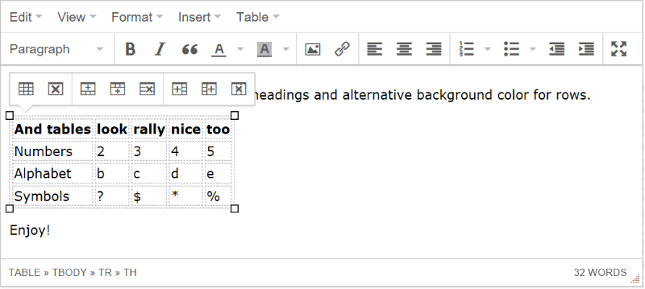

# Blog engine for ASP.NET Core 2.2

This is my fork of Mads Kristensen's [Miniblog.Core](https://github.com/madskristensen/Miniblog.Core) built on ASP.NET Core 2.2.  
It is mostly a playground project and [dogfooding](https://www.centercode.com/blog/2018/11/promote-customer-zero-with-dogfooding) 
exercise with various Azure & web development features that are approachable 
in a simple project that any developer (including me) can understand.

[](https://mattlavallee.visualstudio.com/Miniblog.Core/_build/latest?definitionId=-1)

**Mads' NuGet package:**

[](https://ci.appveyor.com/project/madskristensen/miniblog-core)
[](https://nuget.org/packages/MadsKristensen.AspNetCore.Miniblog/)

[](https://azuredeploy.net/)

**Live demo**: <https://miniblogcore.azurewebsites.net/>  
userId: *demo*  
Password: *demo*



### Custom themes
In search for custom designed themes for MiniBlog.Core? [Click here](https://francis.bio/miniblog-themes/).

## Original Features
- Windows/Open Live Writer support
- RSS and ATOM feeds
- User comments
- Search engine optimized
- All major browsers fully supported (IE 9+)
- Social media integration (Facebook, Twitter, Google+)
- Lazy loads images for better performance
- Easy YouTube video embedding
- Looks great when printed
- Works offline with use of [Service Worker](https://developers.google.com/web/fundamentals/primers/service-workers/)
- Follows best practices for web applications
  - [See DareBoost report](https://www.dareboost.com/en/report/59e928f10cf224d151dfbe2d)

## My Additions & Changes
- Supports multiple users
- Uses SHA256 for password hashing
- Uses [Azure Blob Storage](https://azure.microsoft.com/en-us/services/storage/blobs/) for posts & images instead of the filesystem
- Adds [Azure Cache for Redis](https://azure.microsoft.com/en-us/services/cache/) for acceleration
- Adds [Azure Key Vault](https://azure.microsoft.com/en-us/services/key-vault/) for storing secrets
- Adds [Health Checks](https://docs.microsoft.com/en-us/aspnet/core/host-and-deploy/health-checks?view=aspnetcore-2.2) middleware
- Adds HSTS to force SSL/TLS

## My ToDo List
- Simplify porting UserSecrets to Key Vault
- Refactor IBlogService to use async methods for [Metaweblog](https://github.com/shawnwildermuth/MetaWeblog)
- Port to [RoosterJs](https://github.com/Microsoft/roosterjs) editor
- Add [WebPush](https://github.com/web-push-libs/web-push-csharp) notifications
- Incorporate social notifications for new posts
- Add WordCloud generation
- Add a New Blog Wizard to set up all the Azure bits
- Replicate Mads' NuGet packaging / deployment

## Technical features
- High performance. Gets 100/100 points on Google PageSpeed Insights 
  - [Run PageSpeed Insights](https://developers.google.com/speed/pagespeed/insights/?url=https%3A%2F%2Fminiblogcore.azurewebsites.net%2F)
- Speed Index < 1000
  - [See WebPageTest](http://www.webpagetest.org/result/170928_1R_cf91bb2d800cc389821c5cfa7e353f0d/) 
- Meets highest accessibility standards 
  - [Run accessibility validator](http://wave.webaim.org/report#/https://miniblogcore.azurewebsites.net/)
- W3C standards compliant 
  - [Run HTML validator](https://html5.validator.nu/?doc=https%3A%2F%2Fminiblogcore.azurewebsites.net%2F)
  - [Run RSS validator](https://validator.w3.org/feed/check.cgi?url=https%3A%2F%2Fminiblogcore.azurewebsites.net%2Ffeed%2Frss%2F)
- Responsive web design
  - [See mobile emulators](https://www.responsinator.com/?url=https%3A%2F%2Fminiblogcore.azurewebsites.net%2F)
- Mobile friendly
  - [Run Mobile-Friendly Test](https://search.google.com/test/mobile-friendly?id=i4i-jw3VafvYnjcyHt4jgg)
- Schema.org support with HTML 5 Microdata 
  - [Run testing tool](https://search.google.com/structured-data/testing-tool#url=https%3A%2F%2Fminiblogcore.azurewebsites.net%2F)
- OpenGraph support for Facebook, Twitter, Pinterest and more
  - [Run Facebook validator](https://developers.facebook.com/tools/debug/sharing/?q=https%3A%2F%2Fminiblogcore.azurewebsites.net%2F)
  - [Check the tags](http://opengraphcheck.com/result.php?url=https%3A%2F%2Fminiblogcore.azurewebsites.net%2F#.WdhRDjBlB3g)
- Seach engine optimized
  - [Run SEO Site Checkup](https://seositecheckup.com/seo-audit/miniblogcore.azurewebsites.net)
- Security HTTP headers set
  - [Run security scan](https://securityheaders.io/?q=https%3A%2F%2Fminiblogcore.azurewebsites.net%2F&hide=on&followRedirects=on)
- Uses the [Azure Image Optimizer](https://github.com/madskristensen/ImageOptimizerWebJob) for superb image compression
- Uses a [CDN Tag Helper](https://github.com/madskristensen/WebEssentials.AspNetCore.CdnTagHelpers) to make it easy to serve the images from any CDN.

### YouTube embeds
You can embed any youtube video by using the following syntax in the source of a blog post:

```
[youtube:ScXvuavqhzo]
```

*ScXvuavqhzo* is the ID of the YouTube video which can be found in any YouTube link looking this *youtube.com/watch?v=**ScXvuavqhzo***

## How to use
Clone it.

## Credits
- Original [Miniblog.Core](https://github.com/madskristensen/Miniblog.Core) by Mads Kristensen
- SVG icons by <https://simpleicons.org/>
